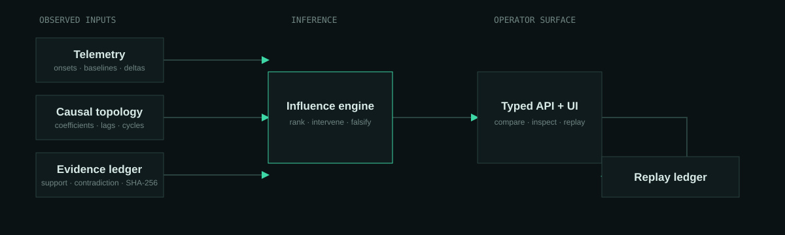
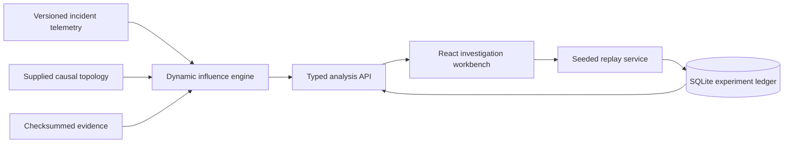

# FaultGraph

[](https://github.com/asp53826/faultgraph/actions/workflows/ci.yml)
[](https://www.python.org/)
[](LICENSE)

FaultGraph is an evidence-first workbench for reasoning about failures in distributed systems. It combines a typed causal graph, telemetry onset analysis, ranked hypotheses, explicit counterfactual interventions, and checksum-addressed replay experiments in one full-stack application.

The central question is deliberately operational:

> If this suspected source had remained at baseline, which downstream symptoms should have disappeared?

The current engine is a transparent dynamic linear influence model over a supplied topology. It is **not** unrestricted causal discovery, and its normalized ranking scores are **not** production posterior probabilities. Every API analysis includes the assumptions and calibration boundary needed to interpret it.



## What is implemented

- A Python causal-analysis engine with cycle-safe max-product influence propagation.
- Three deterministic, labeled incident scenarios with raw telemetry, evidence checksums, and ground truth.
- Counterfactual `do(source=0)` views for every ranked hypothesis.
- A FastAPI service with typed OpenAPI contracts, SSE analysis events, security headers, and SQLite experiment persistence.
- An investigation workbench built in React and TypeScript with an interactive causal graph, propagation tape, evidence inspector, hypothesis ledger, benchmark report, and command palette.
- Deterministic replay experiments with canonical manifests, seeds, SHA-256 identifiers, predicted-versus-observed reduction, and an explicit falsification threshold.
- Backend and frontend tests, strict type checks, linting, container packaging, CI, and Kubernetes deployment manifests.

## Run locally

Requirements: Python 3.11+, [uv](https://docs.astral.sh/uv/), Node.js 22+, and npm 10+.

Terminal 1:

```bash
uv sync --all-groups
uv run faultgraph serve --reload
```

Terminal 2:

```bash
cd apps/web
npm install
npm run dev
```

Open `http://127.0.0.1:5173`. Vite proxies `/api` to `http://127.0.0.1:8000`.

For a production-shaped local run:

```bash
docker compose up --build
```

Then open `http://127.0.0.1:8000`.

## Verify the evidence

```bash
uv run ruff check .
uv run mypy src
uv run pytest --cov --cov-report=term-missing
uv run faultgraph benchmark

cd apps/web
npm run lint
npm run typecheck
npm test
npm run build
```

The benchmark is intentionally small. A perfect score means the current engine recovered the injected source in the three bundled regression cases; it does not establish external validity.

## Architecture



Read [the architecture decision record](docs/ARCHITECTURE.md), [research protocol](docs/RESEARCH_PROTOCOL.md), [threat model](docs/THREAT_MODEL.md), and [design rationale](docs/DESIGN.md) before extending the model.

## Repository map

```text
apps/web/                 React + TypeScript investigation workbench
src/faultgraph/           Engine, scenarios, services, API, persistence, CLI
tests/                    Backend model, contract, and persistence tests
docs/                     Architecture, protocol, design, and security boundaries
deploy/k8s/               Single-replica SQLite deployment and network policy
.github/workflows/        CI and bounded autonomous maintenance
```

## Research boundary

FaultGraph is designed to make uncertainty visible:

- Topology and edge coefficients are supplied, not inferred from production data.
- Onset ordering is extracted from deterministic telemetry using a documented threshold.
- Cycles use strongest-path influence so feedback loops cannot double-count support.
- Counterfactual reductions are model estimates, always paired with a falsification test.
- Benchmark results retain dataset size and limitations beside the score.

## Contributing

See [CONTRIBUTING.md](CONTRIBUTING.md). Security reports should follow [SECURITY.md](SECURITY.md).

## License

[MIT](LICENSE)
